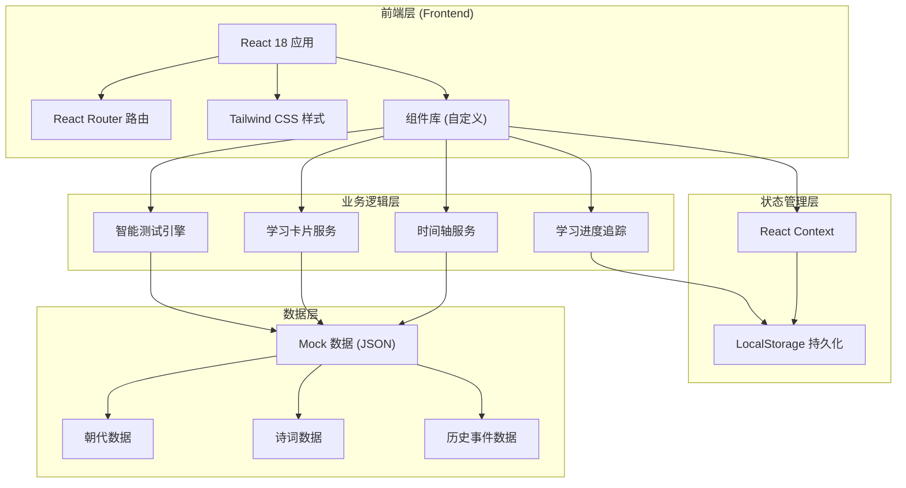
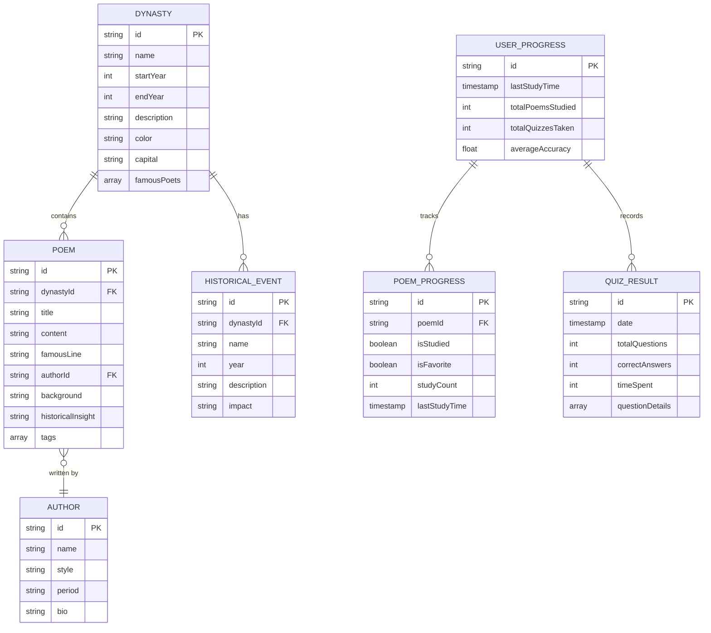

## 1. 架构设计



## 2. 技术描述

- **前端框架**：React@18.2.0 + TypeScript
- **构建工具**：Vite@5.0.0
- **样式方案**：Tailwind CSS@3.4.0 + 自定义CSS变量
- **路由管理**：React Router DOM@6.20.0
- **状态管理**：React Context + useReducer
- **数据持久化**：LocalStorage API
- **图标方案**：Lucide React (融入中国风元素)
- **字体方案**：Google Fonts (思源宋体、马善政楷体)
- **动画方案**：CSS 3D Transform + Framer Motion (可选)

### 初始化方式
使用 Vite 官方模板初始化 React + TypeScript 项目：
```bash
npm create vite@latest . -- --template react-ts
```

## 3. 路由定义

| 路由路径 | 页面组件 | 功能描述 |
|----------|----------|----------|
| `/` | `HomePage` | 首页 - 系统介绍、功能导航、学习概览 |
| `/timeline` | `TimelinePage` | 时间轴地图 - 朝代纵向时间轴、诗词列表 |
| `/card/:poemId` | `CardPage` | 学习卡片 - 卡片翻转、诗词学习、历史解读 |
| `/quiz` | `QuizPage` | 智能测试 - 随机出题、答题反馈、成绩统计 |
| `/progress` | `ProgressPage` | 学习记录 - 已学内容、测试成绩、学习统计 |

## 4. 数据模型

### 4.1 数据模型定义 (ER图)



### 4.2 Mock 数据结构

#### 朝代数据示例
```typescript
interface Dynasty {
  id: string;
  name: string;
  startYear: number;
  endYear: number;
  description: string;
  color: string;
  capital: string;
  famousPoets: string[];
  keyEvents: string[];
}
```

#### 诗词数据示例
```typescript
interface Poem {
  id: string;
  dynastyId: string;
  title: string;
  content: string[];
  famousLine: string;
  author: string;
  authorBio: string;
  background: string;
  historicalInsight: {
    politics?: string;
    economy?: string;
    society?: string;
    culture?: string;
  };
  tags: string[];
}
```

#### 历史事件数据示例
```typescript
interface HistoricalEvent {
  id: string;
  dynastyId: string;
  name: string;
  year: number;
  description: string;
  impact: string;
  relatedPoems?: string[];
}
```

## 5. 核心组件设计

### 5.1 组件树结构

```
App
├── Layout (导航布局)
│   ├── Header (顶部导航)
│   └── Outlet (路由出口)
│
├── HomePage
│   ├── HeroSection (卷轴入场)
│   ├── FeatureNav (功能导航卡片)
│   └── ProgressOverview (学习概览)
│
├── TimelinePage
│   ├── DynastyTimeline (纵向时间轴)
│   ├── DynastyNode (朝代节点)
│   └── PoemList (诗词列表)
│
├── CardPage
│   ├── FlipCard (翻转卡片)
│   ├── CardNavigation (上下首切换)
│   └── StudyActions (学习操作按钮)
│
└── QuizPage
    ├── QuestionCard (题目卡片)
    ├── OptionButton (选项按钮)
    ├── AnswerFeedback (答案反馈)
    └── QuizResult (成绩统计)
```

### 5.2 核心业务逻辑

#### 智能测试引擎 (QuizEngine)
- 输入：已学习的诗词ID列表
- 输出：随机生成的题目数组
- 题型支持：
  1. 诗句填空题 - 根据上下文填写缺失字句
  2. 作者匹配题 - 选择诗词的正确作者
  3. 朝代匹配题 - 选择诗词所属的朝代
  4. 历史理解题 - 根据诗词内容选择对应的历史背景
- 难度自适应：根据正确率动态调整题目难度

#### 学习进度追踪 (ProgressTracker)
- 自动记录每首诗的学习状态
- 追踪测试正确率和用时
- 生成学习统计报告
- 推荐下一步学习内容

## 6. 项目目录结构

```
src/
├── assets/              # 静态资源
│   ├── fonts/           # 字体文件
│   └── images/          # 背景纹理、装饰元素
├── components/          # 公共组件
│   ├── layout/          # 布局组件
│   ├── ui/              # UI基础组件
│   └── features/        # 业务组件
├── context/             # React Context
│   ├── AppContext.tsx   # 全局状态
│   └── ProgressContext.tsx # 学习进度状态
├── data/                # Mock数据
│   ├── dynasties.ts     # 朝代数据
│   ├── poems.ts         # 诗词数据
│   ├── events.ts        # 历史事件数据
│   └── index.ts         # 数据导出
├── hooks/               # 自定义Hooks
│   ├── useProgress.ts   # 学习进度Hook
│   ├── useQuiz.ts       # 测试引擎Hook
│   └── useLocalStorage.ts # 本地存储Hook
├── pages/               # 页面组件
│   ├── HomePage.tsx
│   ├── TimelinePage.tsx
│   ├── CardPage.tsx
│   └── QuizPage.tsx
├── services/            # 业务服务
│   ├── timelineService.ts
│   ├── cardService.ts
│   └── quizService.ts
├── types/               # TypeScript类型定义
│   └── index.ts
├── utils/               # 工具函数
│   ├── animations.ts    # 动画工具
│   └── helpers.ts       # 通用工具
├── App.tsx
├── main.tsx
└── index.css            # 全局样式 + Tailwind配置
```

## 7. 性能优化策略

1. **代码分割**：使用 React.lazy 和 Suspense 实现路由级代码分割
2. **懒加载**：时间轴节点和诗词卡片使用虚拟滚动
3. **数据缓存**：Mock数据首次加载后缓存到内存
4. **动画优化**：使用 CSS transform 和 opacity 实现 GPU 加速
5. **预加载**：预加载当前学习诗词的前后两首诗词数据
